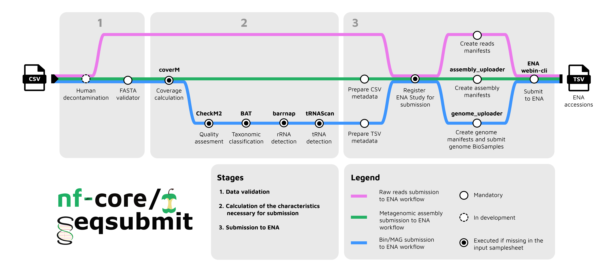

<!--
TODO before submission:
- Confirm ORCID + exact affiliation/department for each author.
- The work reported here also continued at "vibiome 2026" (per author note). I could not find a public,
  BioHackrXiv-registered listing for this event (see https://index.biohackrxiv.org/meetings) — please
  supply its full name, URL, location and dates so it can either be added as a second acknowledged event
  or, if BioHackrXiv only supports one `biohackathon_*` block, credited explicitly in Acknowledgements.
- Add project/group number if one was assigned at the hackathon.
-->

# Abstract

Sequencing experiments generate valuable data that should be shared with the scientific community through public repositories, in line with FAIR principles. Yet submission to nucleotide sequence archives remains a persistent bottleneck: researchers must navigate complex, database-specific metadata schemas and multi-step, interdependent submission procedures before a single record is public. We present SeqSubmit, an nf-core Nextflow [@nextflow] pipeline that automates the submission of raw sequencing reads, metagenomic assemblies, and metagenome-assembled genomes (MAGs) and bins to the European Nucleotide Archive (ENA). Building on Python tools developed by the MGnify team for internal ENA submissions, SeqSubmit computes required statistics (coverage, completeness, contamination, taxonomy) when they are not already available, assembles ENA-compliant manifests, and performs validated, programmatic submission via ENA's Webin-CLI. Version 1.0.0, released in August 2026, supports four submission modes and is available as a community-maintained, fully containerised nf-core pipeline. We describe the pipeline's design, its four submission workflows, and the engineering choices behind it, and discuss current limitations and planned extensions to other INSDC databases.

**Keywords:** nf-core, Nextflow, ENA, INSDC, metagenomics, FAIR data

# Background

Data sharing plays a vital role in advancing scientific research. By openly sharing datasets, scientists allow their work to continue benefiting the scientific community – enabling others to validate findings and build upon existing work thereby accelerating discovery across disciplines. There are many ways to make data publicly available, such as hosting files on institutional FTP servers or depositing datasets in general-purpose repositories like Zenodo, Figshare, Dryad, or institutional archives. These platforms provide accessible storage, assign persistent identifiers (e.g. DOIs), and support long-term preservation of research outputs.

However, general-purpose repositories are not well-suited for nucleotide sequence data. While they support file storage and citation, they do not enforce standardized metadata schemas or structured relationships between biological data entities, nor do they integrate deposited data into global sequence search systems. As a result, they fall short of the FAIR principles (Findable, Accessible, Interoperable, and Reusable [@fair2016]): discovery, integration, and reuse become significantly more difficult.

For biological sequence data, the International Nucleotide Sequence Database Collaboration (INSDC) — comprising the EMBL-EBI European Nucleotide Archive (ENA), NCBI GenBank, and the DNA Data Bank of Japan (DDBJ) — provides a unified, internationally synchronized archiving system designed specifically for nucleotide sequences. However, submission to INSDC databases is considerably more complex than uploading files to a general repository. Each provider has different submission interfaces, tools, and requirements, making submission itself a significant challenge that requires expertise.

The authors of this pipeline's idea and hackathon project leaders are members of the MGnify team [@mgnify2023] – EMBL-EBI's resource for processing and storing metagenomic data. MGnify interacts with INSDC databases primarily by retrieving raw metagenomic reads from ENA and depositing back derivative sequence data — metagenomic assemblies, bins, and Metagenome-Assembled Genomes (MAGs) — generated by its analysis pipelines (miassembler [@miassembler] and genomes-generation [@genomesgeneration]).

Assembly is the process of reconstructing longer DNA sequences (called contigs) from short sequencing reads obtained from a sample. Unlike traditional genome assembly, which contains DNA of a single organism, metagenomic assembly consists of mixed DNA sequences originating from multiple co-occurring organisms. A common approach to disentangle this mixture is binning: grouping contigs that likely originate from the same source organism based on features such as sequence composition and coverage. The resulting bins represent draft genomes of individual populations (TODO: find better definition than "individual populations") present in the sample. When a bin meets defined completeness, contamination, and quality thresholds — following, for example, the MIMAG standard [@bowers2017mimag] — it is termed a Metagenome-Assembled Genome (MAG): a genome reconstructed computationally from metagenomic data rather than sequenced from an isolated organism. This reconstruction process is computationally intensive and cannot realistically be run on a personal computer, which is itself an argument for making the resulting data — and the tools that submit it — as accessible and automated as possible, so that the effort is not duplicated by every group producing it independently.

Over years of submitting metagenomic assemblies and bins/MAGs to ENA, the MGnify team has developed a set of Python packages to partially automate this process. In addition, we actively support external collaborators by sharing our tools and providing guidance for metagenomic data submission. To further simplify and streamline this process, we decided to consolidate our expertise into a single, fully automated pipeline.

# Pipeline design

SeqSubmit targets ENA as its first supported database, reflecting the MGnify team's existing expertise and infrastructure. As the project grows and attracts contributors familiar with NCBI and DDBJ submission systems, we intend to extend support to those databases.

ENA organizes sequencing data in a hierarchical model:
  -	STUDY: The overarching research project
  -	SAMPLE: Biological specimens with associated metadata
  -	EXPERIMENT: Sequencing of a sample, with library preparation details
  -	RUN: Raw sequencing data (e.g. FASTQ files)
  -	ANALYSIS: Processed data (e.g. assemblies, MAGs, annotations)

Each entity carries its own required metadata and must correctly reference its parent entities. (TODO: add here an explanation of the purpose of this model). We do not reproduce that model in detail here — full documentation is available from ENA [@ena_submit_docs] — but note that SeqSubmit's four submission modes mirror it directly: `reads` registers EXPERIMENT and RUN entities that reference pre-existing SAMPLE records, while `metagenomic_assemblies`, `mags` and `bins` register ANALYSIS entities that reference pre-existing RUN records.

SeqSubmit is designed to sit at the end of an analysis pipeline. In a typical metagenomics workflow, raw reads (already submitted to ENA) are used to generate assemblies, which are in turn used to derive bins and MAGs — for example with nf-core/mag [@krakau2022nfcoremag]. SeqSubmit consumes these final data products, computes any missing required statistics, compiles the associated ENA metadata, and performs a fully automated, validated submission using ENA's Webin-CLI [@webincli] — the command-line client officially supported by ENA.
<!-- TODO I need to decide how to rewrite/delete this section: -->
A practical question that arose during development is whether derived data (assemblies, MAGs, bins) must be submitted under a *new* ENA study, separate from the one holding the original raw reads. This is a **recommendation rather than a requirement**: users remain free to submit under their existing study if they own it. SeqSubmit defaults to creating a new, linked study mainly because outputs such as metagenomic assemblies are typically registered as Third Party Annotation (TPA) data, which cannot be added to the original raw-reads study; a new, explicitly linked study keeps this relationship traceable without constraining users who prefer to keep everything under one project.

<!-- TODO this looks more like results to me -->
Submissions can be marked public or private, with a configurable release date, so that data can be reserved ahead of a planned publication while still being formally registered.

Table: SeqSubmit's four submission modes and  their corresponding pipeline workflows.

| Mode                     | Workflow        | Data type                     |
| ------------------------ | ---------------- | ------------------------------ |
| `reads`                  | READSUBMIT       | Raw sequencing reads           |
| `metagenomic_assemblies` | ASSEMBLYSUBMIT   | Metagenomic assemblies (FASTA) |
| `mags`                   | GENOMESUBMIT     | Metagenome-assembled genomes   |
| `bins`                   | GENOMESUBMIT     | Metagenomic bins               |

# Implementation

## Reads submission

The `reads` mode registers raw sequencing reads with ENA. Alongside the FASTQ files, users provide the sequencing platform and instrument, and the library preparation metadata ENA requires to describe an EXPERIMENT (source, selection and strategy, insert size, and a library name/description). SeqSubmit packages this metadata into Webin-CLI-compatible manifests and submits it programmatically, registering the corresponding EXPERIMENT and RUN entities under the target study.

## Metagenomic assembly submission

The `metagenomic_assemblies` mode takes an assembly FASTA file together with the run accession(s) of the reads it was generated from. It performs FASTA validation — including the ENA requirement that metagenomic assemblies contain at least two contigs — before proceeding. Sequencing-depth coverage is mandatory for ENA submission; users can supply a pre-computed value, or SeqSubmit will estimate it from the original reads using CoverM [@coverm]. Once coverage is available, metadata is compiled into an ENA-compliant manifest with assembly\_uploader [@assemblyuploader] and submitted via Webin-CLI. Each successfully submitted assembly is assigned a unique ENA accession (ERZ-prefixed), reported in the pipeline's output summary table under the linked assembly study.

## MAG and bin submission

The `mags` and `bins` modes share a workflow (`GENOMESUBMIT`) and require more extensive metadata than assembly submission: genome completeness and contamination, coverage, taxonomic assignment, and standardised environmental context descriptors (`broad_environment`, `local_environment`, `environmental_medium`), in line with ENA's MIMAG/MISAG checklists [@ena_checklist_mags; @ena_checklist_bins]. Any of these that are not supplied are computed automatically: taxonomic classification via CAT/BAT from the CAT\_pack suite [@catbat], detection of the rRNA/tRNA genes used to assign the ENA assembly-quality category via Barrnap [@barrnap] and tRNAscan-SE [@trnascanse], completeness/contamination via CheckM2 [@checkm2], and coverage via CoverM [@coverm] when raw reads are provided. A dedicated SAMPLE entity is registered for each MAG or bin, ensuring correct taxonomy tracking per genome even when many are derived from the same original sample. Metadata is compiled with genome\_uploader [@genomeuploader] and submitted via Webin-CLI, resulting in an ENA study containing one genome record per submitted MAG or bin, each assigned an ERZ accession reported in the output summary table.

<!-- TODO: confirm with Germana Baldi whether additional accession types (e.g. GCA/WGS) are also
     generated for MAG/bin records and, if so, add a sentence describing them here. -->

<!-- TODO: current known limitation — ENA currently requires manual contact for circular genome
     submissions (relevant with increasing PacBio HiFi assemblies); consider a short note here or
     in Discussion once we confirm current ENA guidance. -->

## Engineering

SeqSubmit is developed under the nf-core template and community standards [@nfcore], with automated linting and nf-test-based continuous integration. It runs with Conda, Docker or Singularity, and can be launched directly on the Seqera Platform. Software dependencies are distributed through Bioconda and BioContainers, and results are summarised with MultiQC [@multiqc].

# Results

Version 1.0.0 of SeqSubmit was released in August 2026, supporting all four submission modes described above. As part of this work, three tools required for ENA submission — Webin-CLI, assembly\_uploader, and genome\_uploader — were newly wrapped as nf-core modules, making them reusable by other pipelines in the nf-core ecosystem. The pipeline passed nf-core's community review process ahead of release.

<!-- TODO: add any concrete usage/adoption numbers, test dataset results, or a worked example
     once available. -->

# Discussion

By consolidating previously separate, internally maintained Python tools into a single nf-core pipeline, SeqSubmit turns ENA submission from a manual, error-prone process into a repeatable pipeline step that can be inserted directly after an assembly/binning workflow such as nf-core/mag. Scoping the first release to ENA let us build on the MGnify team's existing tooling and submission experience, but it does mean SeqSubmit cannot yet submit directly to NCBI or DDBJ, even though INSDC's mirroring means ENA-submitted data becomes available across all three archives within 24 hours.

Some design decisions, such as whether to always create a new linked study for derived data, are deliberately framed as recommendations rather than hard requirements, since submitting groups vary in how they organise their own ENA projects.

# Future work

Planned extensions include optional automated removal of human-derived contigs prior to submission (not yet implemented, but required for some public-health and clinical use cases), broadening database support to NCBI and DDBJ, and community contributions of additional submission modes as new use cases emerge.

# Links to software and data repositories

- Pipeline: <https://github.com/nf-core/seqsubmit>
- assembly\_uploader: <https://github.com/EBI-Metagenomics/assembly_uploader>
- genome\_uploader: <https://github.com/EBI-Metagenomics/genome_uploader>
- ENA Webin-CLI: <https://github.com/enasequence/webin-cli>

# Acknowledgements

This work was started at the nf-core Hackathon Barcelona 2025 (28–29 October 2025), held alongside the Nextflow Summit 2025, and further developed at <!-- TODO: vibiome 2026 — full name/URL/location/dates -->. We thank Evangelos Karatzas for extensive assistance during development, and James Fellows Yates, Matthias De Smet, and Germana Baldi for their review and feedback.

# References
