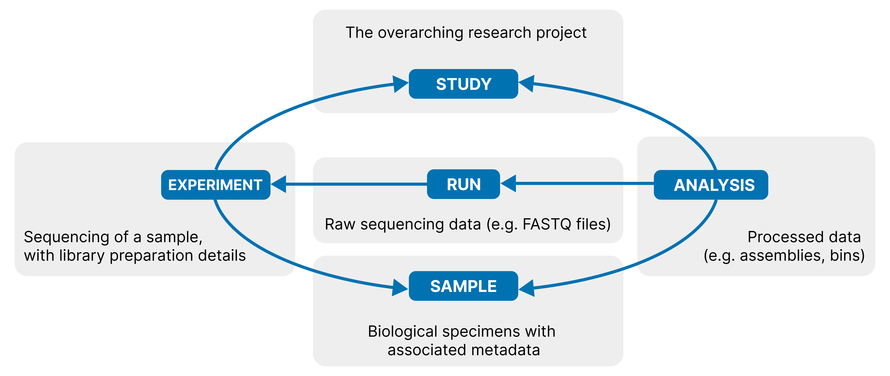

<!--
TODO before submission:
- Confirm ORCID + exact affiliation/department for each author.
- Add project/group number if one was assigned at the hackathon.
- The `biohackathon_*` YAML fields above only support one event (nf-core Hackathon Barcelona 2025,
  where the project started); the other two events — the nf-core Hackathon – March 2026 (11-13 March
  2026, hybrid in-person/online), cited as [@nfcore_hackathon_march2026], and the 2026 Virus
  Bioinformatics + nf-core Hybrid Collaborative Hackathon (ViBioM 2026 satellite event, Vilnius/online,
  12-17 May 2026), cited as [@vibiom2026_hackathon] — are credited in Acknowledgements and cited in
  Results instead.
- `event: SEQSUBMIT25` above is a placeholder, only needed so the PDF generator doesn't crash
  (it hard-requires a non-empty `event` field). None of the three hackathons (nf-core Hackathon
  Barcelona 2025, nf-core Hackathon – March 2026, or the ViBioM 2026 satellite hackathon) appear on
  BioHackrXiv's registered meetings list (https://index.biohackrxiv.org/meetings) — contact the
  meeting organisers about registration, then replace this placeholder with the real assigned code
  before submitting.
-->

# Abstract

Sequencing experiments generate valuable data that should be shared with the scientific community through public repositories, in line with FAIR principles (Findable, Accessible, Interoperable, and Reusable [@fair2016]). Yet submission to nucleotide sequence archives remains a persistent bottleneck: researchers must navigate complex, database-specific metadata schemas and multi-step, interdependent submission procedures before a single record is deposited. We present *nf-core/seqsubmit*, an nf-core Nextflow [@nextflow] pipeline that automates the submission of raw sequencing reads, metagenomic assemblies, Metagenome-Assembled Genomes (MAGs) and bins to the European Nucleotide Archive (ENA) [@ena2024]. Building on Python tools developed by the MGnify team for internal submissions to ENA, *nf-core/seqsubmit* computes required statistics (e.g. coverage depth for assemblies) when they are not already available, assembles metadata in the format of ENA-compliant manifests, and performs validated submission via ENA's Webin-CLI [@webincli]. Version 1.0.0, released in August 2026, supports four data types and is available as a community-maintained, fully containerised nf-core pipeline at <https://github.com/nf-core/seqsubmit>. We describe the pipeline's design, its submission workflows, and the engineering choices behind it, and discuss current limitations and further development.

**Keywords:** nf-core, Nextflow, ENA, INSDC, metagenomics, FAIR data

# Background

Data sharing plays a vital role in advancing scientific research. By openly sharing datasets, scientists allow their work to continue benefiting the scientific community – enabling others to validate findings and build upon existing work, thereby accelerating discovery across disciplines. There are many ways to make data publicly available, such as hosting files on institutional FTP servers or depositing datasets in general-purpose repositories like Zenodo [@zenodo], Figshare [@figshare], Dryad [@dryad2010], or institutional archives. These platforms provide accessible storage, assign persistent identifiers (e.g. DOIs), and support long-term preservation of research outputs.

However, general-purpose repositories are not well-suited for nucleotide sequence data. While they support file storage and citation, they do not enforce standardized metadata schemas or structured relationships between biological data entities, nor do they integrate deposited data into global sequence search systems. As a result, they fall short of the FAIR principles (Findable, Accessible, Interoperable, and Reusable [@fair2016]): discovery, integration, and reuse become significantly more difficult.

For biological sequence data, the International Nucleotide Sequence Database Collaboration (INSDC) — comprising the EMBL-EBI European Nucleotide Archive (ENA) [@ena2024], NCBI GenBank [@genbank2024], and the DNA Data Bank of Japan (DDBJ) [@ddbj2024] — provides a unified, internationally synchronized archiving system designed specifically for nucleotide sequences: data submitted to any one of the three databases is mirrored to the other two, so a single submission becomes available through all three. However, submission to INSDC databases is considerably more complex than uploading files to a general repository. Each provider has different submission interfaces, tools, and requirements, making submission itself a significant challenge that requires expertise.

The authors of this pipeline's idea and hackathon project leaders are members of the MGnify team [@mgnify2023] – EMBL-EBI's resource for processing and storing metagenomic data. MGnify interacts with INSDC databases primarily by retrieving raw metagenomic reads from ENA and depositing back derivative sequence data.

Assembly is the process of reconstructing longer DNA sequences (called contigs) from short sequencing reads obtained from a sample. Unlike traditional genome assembly, which contains DNA of a single organism, metagenomic assembly consists of mixed DNA sequences originating from multiple co-occurring organisms. A common approach to disentangle this mixture is binning: grouping contigs that likely originate from the same source organism based on features such as sequence composition and coverage. The resulting bins represent draft genomes attributed to individual microbial taxa present in the sample. When a bin meets defined completeness, contamination, and quality thresholds — following, for example, the MIMAG (Minimum Information about a Metagenome-Assembled Genome) standard [@bowers2017mimag] — it is termed a Metagenome-Assembled Genome (MAG): a genome reconstructed computationally from metagenomic data rather than sequenced from an isolated organism. This reconstruction process is computationally intensive and cannot realistically be run on a personal computer, which is itself an argument for making the resulting data — and the tools that submit it — as accessible and automated as possible, so that the effort is not duplicated by every group producing it independently.

Over years of submitting metagenomic assemblies and bins/MAGs to ENA, the MGnify team has developed a set of Python packages — assembly\_uploader and genome\_uploader — to partially automate this process. In addition, we actively support external collaborators by sharing our tools and providing guidance for metagenomic data submission. To further simplify and streamline this process, we decided to consolidate our expertise into a single, fully automated pipeline, built within nf-core [@nfcore] — a community effort that curates standardised, best-practice Nextflow [@nextflow] pipelines for bioinformatics — giving users a consistent interface and built-in reproducibility guarantees.

# Pipeline design

*nf-core/seqsubmit* targets ENA as its first supported database, reflecting the MGnify team's existing expertise and infrastructure.

*nf-core/seqsubmit* v1.0.0 implements four modes — `reads`, `metagenomic_assemblies`, `mags`, and `bins` — each routed to a dedicated workflow (Table 1). Each workflow of the pipeline follows its own internal logic and processing flow defined by metadata requirements and submission procedure of each data type.

Table: *nf-core/seqsubmit*'s four submission modes and their corresponding pipeline workflows.

| Mode                     | Workflow         | Data type                     |
| ------------------------ | ---------------- | ------------------------------ |
| `reads`                  | READSUBMIT       | Raw sequencing reads           |
| `metagenomic_assemblies` | ASSEMBLYSUBMIT   | Metagenomic assemblies         |
| `mags`                   | GENOMESUBMIT     | Metagenome-assembled genomes   |
| `bins`                   | GENOMESUBMIT     | Metagenomic bins               |

## ENA data model

The pipeline modes follow the model ENA uses to organise sequencing data (Figure 1; see the ENA documentation for details [@ena_submit_docs]).

This hierarchy mirrors how sequencing experiments are actually designed and run — a STUDY groups the SAMPLEs under investigation, each SAMPLE is sequenced through one or more EXPERIMENTs, each EXPERIMENT produces one or more RUNs, and any downstream ANALYSIS is performed on those RUNs. Because every entity is required to reference its parent, metadata is inherited rather than re-entered at each level: a SAMPLE's collection and taxonomic metadata automatically carries through to everything sequenced or derived from it, so submitters only need to supply what is genuinely new at each step. This keeps raw data and any products derived from it traceable back to their origin, consistently validated, and machine-readable — precisely the properties needed to satisfy the FAIR principles referenced above. *nf-core/seqsubmit*'s modes map directly onto that model (shown on Figure 2): `reads` mode registers EXPERIMENT and RUN entities that reference pre-existing SAMPLE records, while `metagenomic_assemblies`, `mags`, and `bins` modes register ANALYSIS entities that reference pre-existing RUN records. In every case, the data submitted is ultimately associated with a STUDY — the top-level container into which all of ENA's records, raw or derived, are organised.

## ENA Webin account and data ownership

Creating new studies, registering samples, and uploading raw reads, assemblies, MAGs, and other sequence data requires a dedicated Webin account, created through the Webin Portal [@ena_webin_portal]. Registration issues each user a unique Webin ID and password, which serve as the primary authentication credentials for all ENA submissions, downstream data management, and private data access — *nf-core/seqsubmit*'s submission steps rely on exactly these credentials. 

Ownership of a STUDY belongs to the Webin account under which it was created, and only that account — or a user its holder has explicitly granted permission to — can submit data to it afterwards. More generally, every piece of data submitted to ENA has an owner, determined by the Webin account it was submitted under, and only that owner can manage it afterwards — for example, updating its metadata.

<!-- TODO I need to decide how to rewrite/delete this section: 
A practical question that arose during development is whether derived data (assemblies, MAGs, bins) must be submitted under a *new* ENA study, separate from the one holding the original raw reads. This is a **recommendation rather than a requirement**: users remain free to submit under their existing study if they own it. *nf-core/seqsubmit* defaults to creating a new, linked study mainly because outputs such as metagenomic assemblies are typically registered as Third Party Annotation (TPA) data, which cannot be added to the original raw-reads study; a new, explicitly linked study keeps this relationship traceable without constraining users who prefer to keep everything under one project.
-->

![ENA data-model entity relationships for each *nf-core/seqsubmit* mode. Red entities and reference links must already exist in ENA before submission; green entities and links are created during submission; grey entities and links are optional and may already exist. For `bins`/`mags` mode, panels (A) and (B) correspond to the two accepted forms of the source accession — a RUN or an ANALYSIS, respectively (Table 4). For clarity, all panels show submission data being added to the same STUDY as the source data; in practice this is not required, and a different STUDY, either user-supplied or created by *nf-core/seqsubmit*, may be used instead (see Implementation).](../figures/data_model_schema.png)

## Private vs public data in ENA

In ENA, private data has been formally registered and assigned permanent accessions, but is not retrievable through ENA's public browser, API, or search interfaces — only the owning Webin account (or a user it has explicitly granted permission to) can access it. Public data, by contrast, is fully available: anyone can find, browse, and download it through ENA's standard interfaces. Visibility is therefore the only distinction between the two states; the underlying record and its accessions do not change when data transitions from private to public.

Whether a given piece of data is public or private is determined at the STUDY level: privacy is not set per record but is a property of the STUDY it belongs to, controlled by a "Hold until date" specified when the STUDY is created. Before that date, the STUDY and everything submitted under it remain private and visible only to its owner; once the date is reached, the data is released automatically. This hold period can be set to at most two years from the submission date. The mechanism exists to let researchers formally register their data and obtain permanent accessions — often a requirement from funders and journals — without having to make the data public immediately, for example, while a manuscript describing it is still under review or a related dataset is still being generated. Crucially, this transition only goes one way: once a STUDY's hold period has elapsed and its data has become public, it cannot be made private again. *nf-core/seqsubmit* exposes the hold date as a pipeline parameter, letting users set it without any manual step in ENA's own submission interfaces; this only takes effect when the pipeline itself registers the target study, since for a pre-existing study the hold date was already fixed at its creation and cannot be changed through this parameter.

# Implementation

As is conventional for nf-core pipelines, every mode takes its input as a samplesheet, with one row per record to be submitted; the exact columns required differ by mode. All four submission modes (listed in Table 1) then share a common three-stage structure, shown in Figure 3: (1) data validation, (2) calculation of the characteristics required for submission, and (3) submission to ENA. The `reads` mode (READSUBMIT) skips the first two stages, since ENA's requirements for raw reads include no computed statistics, so reads are submitted directly using the metadata already supplied in the input samplesheet; `metagenomic_assemblies` (ASSEMBLYSUBMIT) and `mags`/`bins` (GENOMESUBMIT) pass through all three.

In the data validation stage, input FASTA files are checked for basic format compliance and for containing more than one contig — a requirement ENA enforces for all assembly-type submissions [@ena_fileprep_assembly]. We also plan to add an optional human-sequence decontamination step at this stage; it is not yet implemented in v1.0.0.

In the second stage, *nf-core/seqsubmit* computes any of the characteristics required for ENA submission that are missing from the input samplesheet, so users only need to provide what they already have. For `metagenomic_assemblies` this is limited to coverage depth. For `mags` and `bins`, submission additionally requires taxonomic classification, genome completeness and contamination values, and information on the presence or absence of rRNA and tRNA genes — used together to assign the assembly-quality category — high-quality, medium-quality, or low-quality draft — per the MIMAG criteria introduced above [@bowers2017mimag].

In the submission stage, all three workflows (Table 1) first ensure a target ENA study is in place — using the accession supplied by the user as input, or registering a new study automatically if none was supplied. Then the workflows diverge to build their manifests — the metadata format processed by ENA's Webin-CLI [@webincli], the command-line client officially supported by ENA. `reads` manifests are created directly, while `metagenomic_assemblies` and `mags`/`bins` rely on custom MGnify tools purpose-built for this — assembly\_uploader [@assemblyuploader] and genome\_uploader [@genomeuploader] respectively. In every case, the resulting manifests then undergo validated submission using Webin-CLI. For every mode, the pipeline's final output is a summary table of the ENA accessions assigned to each submitted record.

## Reads submission

In the `reads` mode, the READSUBMIT workflow handles registration of raw sequencing reads with ENA. Alongside the FASTQ files, users provide the accession of the source SAMPLE the reads were generated from, along with the sequencing platform and instrument, and the library preparation metadata ENA requires to describe an EXPERIMENT (source, selection, strategy, insert size, and a library name/description) (Table 2).

Table: Metadata fields the user provides to *nf-core/seqsubmit* for the `reads` mode.

| Field | Required | Target ENA record |
| --- | --- | --- |
| Experiment name | Yes | EXPERIMENT |
| SAMPLE accession | Yes | EXPERIMENT |
| Sequencing platform | Yes | EXPERIMENT |
| Sequencer instrument | Yes | EXPERIMENT |
| Library source | Yes | EXPERIMENT |
| Library selection | Yes | EXPERIMENT |
| Library strategy | Yes | EXPERIMENT |
| Library name | No | EXPERIMENT |
| Library description | No | EXPERIMENT |
| Insert size | No | EXPERIMENT |

*nf-core/seqsubmit* packages this metadata into Webin-CLI-compatible manifests and submits it with Webin-CLI [@webincli], registering the corresponding EXPERIMENT and RUN entities under the target study and linking them to the given SAMPLE. Each registered EXPERIMENT is assigned an ERX-prefixed accession and each RUN an ERR-prefixed accession; both are reported in the pipeline's output summary table. RUN accessions are what downstream modes (`metagenomic_assemblies`, `mags`, and `bins`) expect as their source-RUN reference.

## Metagenomic assembly submission

The `metagenomic_assemblies` mode runs the ASSEMBLYSUBMIT workflow. Its input is an assembly FASTA file together with the run accession of the reads it was generated from (Table 3). It performs FASTA validation — including the ENA requirement that metagenomic assemblies contain at least two contigs — before proceeding. Sequencing-depth coverage is mandatory for ENA submission; users can supply a pre-computed value, or *nf-core/seqsubmit* will estimate it from the original reads using CoverM [@coverm].

Table: Metadata fields the user provides to *nf-core/seqsubmit* for the `metagenomic_assemblies` mode.

| Field | Required | Target ENA record |
| --- | --- | --- |
| Assembly name | Yes | ANALYSIS |
| Coverage | No — computed automatically | ANALYSIS |
| Run accession | Yes | ANALYSIS |
| Assembler | Yes | ANALYSIS |
| Assembler version | Yes | ANALYSIS |

Once coverage is available, *nf-core/seqsubmit* prepares a CSV file matching assembly\_uploader's expected input format; assembly\_uploader [@assemblyuploader] then fetches additional metadata from the ENA API and compiles this into an ENA-compliant manifest, which is submitted via Webin-CLI. Each successfully submitted assembly is assigned a unique ENA accession (ERZ-prefixed), reported in the pipeline's output summary table. This ERZ accession should only be used to access the data in the Webin portal and ENA browser. It is not recommended to cite it in publications ([@ena_primary_metagenome_docs]); for this mode, the accessions ENA considers stable enough for publication are the STUDY (PRJEB-prefixed) and SAMPLE (SAMEA-prefixed) accessions that are referenced by the submitted assembly.

## MAG and bin submission

The `mags` and `bins` modes share a single workflow (`GENOMESUBMIT`) because they follow a similar submission process: both require broadly similar metadata, and both require registering a dedicated genome SAMPLE for every submitted MAG or bin. This SAMPLE is virtual, in that it does not correspond to any physical specimen that was ever collected or sequenced — it exists solely so the MAG's or bin's metadata can be correctly registered in ENA — but it is nonetheless a fully real, permanently accessioned ENA record, like any other SAMPLE. It is linked back to the real, original source SAMPLE through the "derived from" attribute in its metadata, which is why it is also referred to as a derived SAMPLE. This step is necessary because an ENA ANALYSIS record does not itself carry taxonomy metadata: taxonomy is inherited from whichever SAMPLE the ANALYSIS is attached to. Since each MAG or bin has its own taxonomic identity, distinct from the source SAMPLE's, *nf-core/seqsubmit* registers a new virtual, derived genome-specific SAMPLE for each one so that its taxonomy is correctly and individually inherited by the resulting ANALYSIS record. The `mags` and `bins` modes differ in the details of SAMPLE registration: each uses a different ENA checklist — a predefined set of metadata fields and validation rules tailored to a specific sample type. Specifically, `mags` uses ERC000047 and `bins` uses ERC000050 [@ena_checklist_mags; @ena_checklist_bins]. MAGs and bins are also registered as different assembly types: "Metagenome-Assembled Genome (MAG)" for `mags` and "binned metagenome" for `bins`.

Because both modes accept binned genomes, it may not be obvious which one a given genome should be submitted under. Per ENA's guidance [@ena_mag_docs], `bins` is the default: it accepts any set of contigs identified as belonging to a single taxon, with no upper limit on how many bins a study can contain, so the full output of a binning run should normally be submitted this way. `mags` is reserved for a much smaller, curated subset — at most one genome per species within a biome, selected as the highest-quality, most representative assembly for that taxon — for example via de-replication with a tool such as dRep [@olm2017drep], which collapses near-identical genomes into a single representative — and expected to meet ENA's high-quality MIMAG thresholds. In practice, this means submitting the complete set of derived genomes as `bins`, and separately submitting only the single best representative per species as a `mags` record.

The `mags` and `bins` modes require more extensive metadata than assembly submission (Table 4), in line with their checklists: genome completeness and contamination, coverage, taxonomic assignment, and standardised environmental context descriptors describing where the sample was collected: `broad_environment` (the major biome sampled, e.g. marine or soil), `local_environment` (the immediate habitat within it), and `environmental_medium` (the physical material collected, e.g. sediment or water). The environmental descriptors must always be supplied by the user, as *nf-core/seqsubmit* has no way to infer them from the input data; the remaining values are computed automatically when not already supplied: taxonomic classification via BAT from the CAT\_pack suite [@catbat], detection of the rRNA/tRNA genes used to assign the ENA assembly-quality category via Barrnap [@barrnap] and tRNAscan-SE [@trnascanse], completeness/contamination via CheckM2 [@checkm2], and coverage via CoverM [@coverm] when raw reads are provided.

Table: Metadata fields the user provides to *nf-core/seqsubmit* for the `mags` and `bins` modes.

| Field | Required | Target ENA record |
| --- | --- | --- |
| Genome name | Yes | SAMPLE, ANALYSIS |
| Genome coverage | No — computed automatically | ANALYSIS |
| Source run/assembly accession | Yes | SAMPLE |
| Assembly software | Yes | SAMPLE |
| Binning software | Yes | SAMPLE |
| Binning parameters | Yes | SAMPLE |
| Statistics-generation software | No — genome quality statistics recomputed automatically if not provided  | SAMPLE |
| Completeness | No — computed automatically | SAMPLE |
| Contamination | No — computed automatically | SAMPLE |
| Metagenome (taxonomic identifier) | Yes | SAMPLE |
| Broad environmental context | Yes | SAMPLE |
| Local environmental context | Yes | SAMPLE |
| Environmental medium | Yes | SAMPLE |
| rRNA/tRNA presence | No — computed automatically | SAMPLE |
| NCBI taxonomic lineage | No — computed automatically | SAMPLE |

*nf-core/seqsubmit* prepares a TSV file matching genome\_uploader's expected input format. For each MAG or bin, genome\_uploader [@genomeuploader] then fetches additional metadata from the ENA API, registers a dedicated SAMPLE entity — ensuring correct taxonomy tracking per genome even when many are derived from the same original sample — and compiles the corresponding metadata into a Webin-CLI-compatible manifest, which is then submitted via Webin-CLI. This results in an ENA study containing one genome record per submitted MAG or bin, each assigned an accession (ERZ-prefixed) reported in the output summary table. For `bins`, this ERZ accession should only be used to access the data in the Webin portal and ENA browser, and it is not recommended to cite it in publications ([@ena_binned_metagenome_docs]); the accessions ENA considers stable enough for publication are the STUDY (PRJEB-prefixed) and genome SAMPLE (SAMEA-prefixed) accessions assigned at registration. For `mags`, the ERZ accession is temporary and intended only for use within the Webin submission service, and should not be cited either ([@ena_mag_docs]). Once ENA has fully processed a MAG, a long-term GCA-prefixed genome assembly accession and individual sequence accessions are assigned; these can be retrieved from the Webin Portal or the Webin reports service, or via the email notification ENA sends once processing completes [@ena_mag_docs].

<!-- TODO: current known limitation — ENA currently requires manual contact for circular genome
     submissions (relevant with increasing PacBio HiFi assemblies); consider a short note here or
     in Discussion once we confirm current ENA guidance. -->

## Engineering

*nf-core/seqsubmit* is developed under the nf-core template and community standards [@nfcore], with automated linting and nf-test-based continuous integration. It runs with Conda, Docker or Singularity, and can be launched directly on the Seqera Platform. Software dependencies are distributed through Bioconda and BioContainers, and results are summarised with MultiQC [@multiqc].

# Results

Work on *nf-core/seqsubmit* began in October 2025 at the nf-core Hackathon Barcelona 2025, where the project's initial two workflows, ASSEMBLYSUBMIT (mode `metagenomic_assemblies`) and GENOMESUBMIT (modes `mags` and `bins`), were started. Both workflows were completed at the nf-core Hackathon – March 2026 (11–13 March 2026, hybrid in-person/online) [@nfcore_hackathon_march2026], where work on the third mode, `reads`, also began. The `reads` mode was completed in Spring 2026 at the nf-core/seqsubmit project of the 2026 Virus Bioinformatics + nf-core Hybrid Collaborative Hackathon, a satellite event of the International Virus Bioinformatics Meeting 2026 (ViBioM 2026) held online and in Vilnius, Lithuania [@vibiom2026_hackathon]. Version 1.0.0, bringing all four modes together, was released in August 2026.

To wrap the submission helpers each mode depends on, we developed nine pipeline-specific local modules: `registerstudy` and `ena_webin_cli_wrapper` handle study registration and submission itself; `create_assembly_metadata_csv` and `create_genome_metadata_tsv` prepare CSV/TSV files matching assembly\_uploader's and genome\_uploader's expected input formats; `create_reads_manifest`, `generate_assembly_manifest`, and `genome_upload` prepare and submit the manifests for each data type via assembly\_uploader and genome\_uploader; and `rename_fasta_for_catpack` and `count_rna` support the taxonomic and rRNA/tRNA characterisation used by the `mags`/`bins` mode. Alongside these, we reused nine existing modules from the central nf-core/modules repository (including barrnap, CheckM2, CoverM, CAT\_pack, and tRNAscan-SE).

For taxonomic classification, we developed the `fasta_classify_catpack` subworkflow based on the tools from CAT\_pack and contributed it back to the central nf-core/subworkflows repository, making it directly reusable by other nf-core pipelines. Three further subworkflows were kept local to *nf-core/seqsubmit*: one for input validation, one for genome quality assessment (based on CheckM2), and one for rRNA/tRNA gene detection (uses barrnap and tRNAscan-SE).

All input metadata is validated against dedicated JSON schemas — one per mode's samplesheet, plus one for the pipeline's own parameters — so malformed or incomplete input is caught with an informative error before a run starts, rather than failing partway through submission.

Alongside the pipeline itself, we wrote detailed usage documentation covering all four modes, available at [nf-co.re/seqsubmit/usage](https://nf-co.re/seqsubmit/usage) [@seqsubmit_usage_docs].

We also built a suite of 18 nf-test tests exercising each module and workflow under the range of situations *nf-core/seqsubmit* is designed to handle: for example, whether a target STUDY accession is supplied or needs to be registered automatically, whether required statistics (coverage, completeness, contamination, taxonomy) are supplied or need to be computed, and single- versus paired-end reads.

Beyond its own test suite, *nf-core/seqsubmit* has already been used in production: a partner project used the `metagenomic_assemblies`, `mags`, and `bins` modes to submit its data to ENA, resulting in 26,621 bins, 4,756 MAGs, and 801 assemblies deposited.

# Discussion

By consolidating previously separate, internally maintained Python tools into a single nf-core pipeline, *nf-core/seqsubmit* turns ENA submission from a manual, error-prone process into a repeatable pipeline step that can be inserted directly after an assembly/binning workflow such as nf-core/mag [@krakau2022nfcoremag]. Scoping the first release to ENA let us build on the MGnify team's existing tooling and submission experience, but it does mean *nf-core/seqsubmit* cannot yet submit directly to NCBI or DDBJ, even though INSDC's mirroring means ENA-submitted data becomes available across all three archives.

<!-- TODO work on this text:
Some design decisions, such as whether to always create a new linked study for derived data, are deliberately framed as recommendations rather than hard requirements, since submitting groups vary in how they organise their own ENA projects.
-->

# Future work

On the roadmap is support for co-assemblies, so that assemblies and their derived bins/MAGs pooled from multiple sequencing runs can be submitted alongside single-run data ([nf-core/seqsubmit#61](https://github.com/nf-core/seqsubmit/issues/61); already underway for assemblies via [nf-core/seqsubmit#66](https://github.com/nf-core/seqsubmit/pull/66)). We also plan to extend metadata tracking so that assemblies and MAGs/bins can be submitted even when their source reads or assembly accession cannot currently be resolved automatically ([nf-core/seqsubmit#29](https://github.com/nf-core/seqsubmit/issues/29), [nf-core/seqsubmit#87](https://github.com/nf-core/seqsubmit/issues/87)), and to extend automated statistics generation beyond its current prokaryote focus to cover eukaryotic MAGs/bins ([nf-core/seqsubmit#40](https://github.com/nf-core/seqsubmit/issues/40) and viral genomes [nf-core/seqsubmit#63](https://github.com/nf-core/seqsubmit/issues/63)). Further planned work includes adding dedicated handling for single-contig assemblies and MAGs/bins — which ENA classifies as chromosomal assemblies with their own submission procedure.

Further planned extensions include optional automated removal of human-derived contigs prior to submission (not yet implemented, but advisable to comply with ethical and legal guidelines). Looking further ahead, we intend to extend submission support beyond ENA to NCBI and DDBJ as the project grows and attracts contributors experienced with those systems.

# Links to software and data repositories

- Pipeline: <https://github.com/nf-core/seqsubmit>
- assembly\_uploader: <https://github.com/EBI-Metagenomics/assembly_uploader>
- genome\_uploader: <https://github.com/EBI-Metagenomics/genome_uploader>
- ENA Webin-CLI: <https://github.com/enasequence/webin-cli>

# Acknowledgements

This work was started at the nf-core Hackathon Barcelona 2025 (28–29 October 2025), held alongside the Nextflow Summit 2025; continued at the nf-core Hackathon – March 2026 (11–13 March 2026, hybrid in-person/online) [@nfcore_hackathon_march2026]; and further developed at the 2026 Virus Bioinformatics + nf-core Hybrid Collaborative Hackathon (12–17 May 2026), a satellite event of the International Virus Bioinformatics Meeting 2026 held online and in Vilnius, Lithuania [@vibiom2026_hackathon]. We thank Evangelos Karatzas for extensive assistance during development, and James Fellows Yates, Matthias De Smet, and Germana Baldi for their review and feedback.

# References
